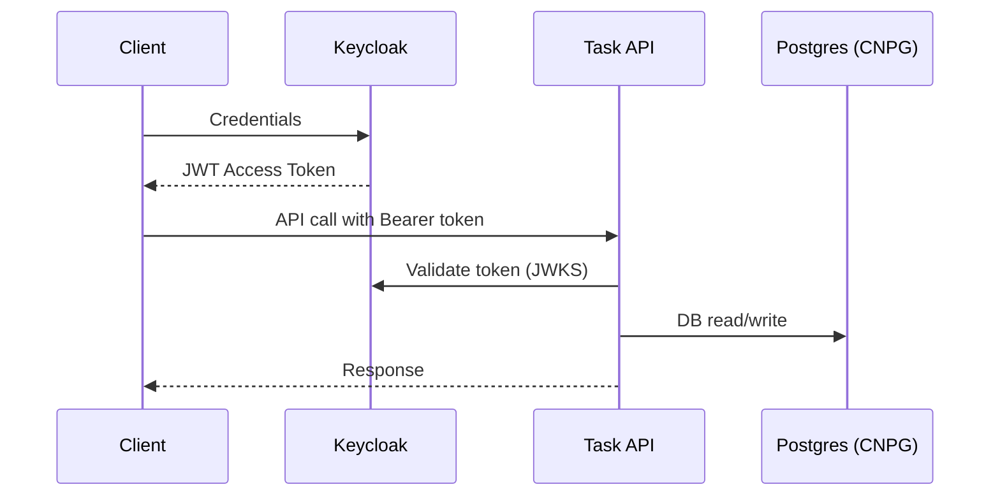
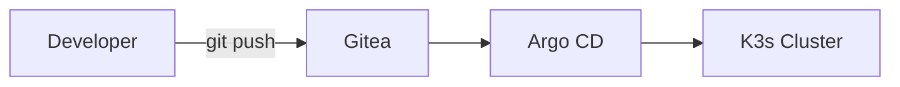

# Cloud-Native Gauntlet

Full-stack, offline-first cloud-native system running locally on K3s with a Rust API, PostgreSQL via CloudNativePG, Keycloak auth, GitOps with Argo CD/Gitea, Linkerd service mesh, and monitoring. This README is the single source of truth and links to concise READMEs in each subdirectory.

## Table of Contents
- Overview
- Architecture
- Challenge Brief & Progress
- Getting Started (offline, from scratch)
- Verification & Testing
- Troubleshooting
- Diagrams
- Subdocs index
- License & contributions

## Overview
- Infrastructure: Multipass VMs provisioned by Terraform; K3s configured by Ansible
- Backend: Rust Axum Task API with JWT auth (Keycloak), Postgres (CNPG)
- Auth: Keycloak realm/client bootstrap job
- GitOps: Argo CD apps, Gitea
- Service Mesh: Linkerd (namespaces labeled for injection)
- Monitoring: Prometheus/Grafana; Linkerd viz helper script
- Offline-first: local registry supported; scripts idempotent

## Architecture
```mermaid
flowchart LR
  user[User/Client]

  subgraph k3s["K3s Cluster"]
    ingress["Ingress (Traefik)"]

    subgraph backendns["backend ns"]
      api["Task API Pod<br/>Linkerd sidecar"]
    end

    subgraph keyns["keycloak ns"]
      kc["Keycloak Pod<br/>Linkerd sidecar"]
    end

    subgraph gitns["gitea ns"]
      gitea["Gitea Pod<br/>Linkerd sidecar"]
    end

    subgraph dbns["database ns"]
      cnpg[("PostgreSQL - CNPG Cluster")]
    end

    subgraph argons["argocd ns"]
      argo["Argo CD"]
    end

    subgraph monns["monitoring ns"]
      prom["Prometheus"]
      graf["Grafana"]
    end
  end

  user -->|HTTP(S)| ingress
  ingress -->|host: task-api.local| api
  ingress -->|host: keycloak.local| kc
  api --> cnpg
  argo <--> gitea
  prom --> api
  prom --> kc
  graf --> prom
```

## Challenge Brief & Progress
Status aligned with “Twelve Trials”. Checked items are implemented; unchecked are pending or partial.

- Day 1-2: Cluster & Infra
  - [x] VMs via Multipass (Terraform)
  - [x] Configure K3s with Ansible
  - [x] Offline prep (hosts helper in deploy script)
  - [ ] Pre-pull images/local registry workflow documentation (partial)
- Day 3-4: Application
  - [x] Rust Axum API with JWT auth, tasks, logging
  - [x] Postgres integration via CNPG
  - [x] Local docker-compose for dev
- Day 5: Containerization
  - [x] Multi-stage Dockerfile and build script
  - [x] Push to local registry (script in app dir)
- Day 6-7: Database & Deployment
  - [x] CNPG operator and cluster
  - [x] Secrets/ConfigMaps; migrations job
  - [x] Deployment/Service/Ingress for API
- Day 8: Keycloak
  - [x] Keycloak deployment, service, ingress
  - [x] Bootstrap realm/client/user job
  - [x] Validate tokens in API
- Day 9-10: GitOps
  - [x] Argo CD apps and app-of-apps
  - [x] Gitea deployment and ingress
  - [ ] CI pipeline (Drone manifests present; needs configuration)
- Day 11: Service Mesh
  - [x] Namespaces labeled for Linkerd injection
  - [x] Observability helper (viz, tap, routes)
- Day 12: Docs
  - [x] This unified README and subdocs
  - [x] Mermaid diagrams

Victory conditions summary:
- Offline-capable: partial (local registry available; document usage below)
- Idempotent: setup/deploy scripts are designed to be rerunnable
- GitOps/Keycloak/Linkerd working: implemented

## Getting Started (offline, from scratch)
Requirements: Linux, Terraform, Ansible, Multipass, kubectl, jq, ssh-key, linkerd CLI (optional), 8+ GB RAM.

1) Clone
```bash
git clone <REPO_URL> cloud-native-gauntlet
cd cloud-native-gauntlet
```

2) Bootstrap infra and K3s
```bash
chmod +x scripts/*.sh
./scripts/setup.sh
```

3) Install Argo CD (optional now, required for GitOps)
```bash
chmod +x gitops/scripts/install-argocd.sh
./gitops/scripts/install-argocd.sh
```

4) Deploy apps (DB, API, Keycloak, Gitea, GitOps apps, Drone, Linkerd labels)
```bash
./scripts/deploy.sh
```

5) Hosts entries (ingress hosts resolved to master IP)
```bash
./scripts/deploy.sh   # this script will ensure /etc/hosts has: task-api.local keycloak.local gitea.local registry.local drone.local
# If needed manually:
# echo "<MASTER_IP> task-api.local keycloak.local gitea.local registry.local drone.local" | sudo tee -a /etc/hosts
```

6) Optional: Observability helpers
```bash
./scripts/observability.sh checks
./scripts/port-forward-all.sh
# Then open:
# - http://localhost:9090 (Prometheus)
# - http://localhost:3000 (Grafana)
# - http://localhost:8084 (Linkerd Viz)
```

Local registry usage (offline builds)
```bash
cd apps/backend/task-api
chmod +x build-and-push.sh
./build-and-push.sh  # builds and pushes to registry.local:5000/task-api:latest
```

## Verification & Testing
Cluster basics
```bash
kubectl get nodes
kubectl get pods -A
kubectl get svc -A
kubectl get ingress -A
```

API health
```bash
curl -i http://task-api.local/health || curl -i http://task-api.local/api/health
```

Database (CNPG)
```bash
kubectl get cluster.postgresql.cnpg.io -A
kubectl -n database get pods
kubectl -n database logs job/task-migrations --tail=200
kubectl -n database port-forward svc/cluster-app-rw 5432:5432 &
psql "postgres://admin:<password>@localhost:5432/<db>" -c '\l' || true
```

Keycloak token and protected call
```bash
export REALM=task-realm
export CLIENT_ID=task-api-client
export USERNAME=user
export PASSWORD=pass
TOKEN=$(curl -s -X POST "http://keycloak.local/realms/$REALM/protocol/openid-connect/token" \
  -H "Content-Type: application/x-www-form-urlencoded" \
  -d "grant_type=password" -d "client_id=$CLIENT_ID" -d "username=$USERNAME" -d "password=$PASSWORD" | jq -r .access_token)
curl -i -H "Authorization: Bearer $TOKEN" http://task-api.local/api/tasks
```

GitOps (Argo CD)
```bash
kubectl -n argocd get applications | cat
kubectl -n argocd port-forward svc/argocd-server 8080:443 &
# Open https://localhost:8080
echo "user: admin"
kubectl -n argocd get secret argocd-initial-admin-secret -o jsonpath='{.data.password}' | base64 -d; echo
```

Linkerd checks
```bash
linkerd check || true
linkerd viz check || true
kubectl get ns --show-labels | grep linkerd.io/inject || true
```

## Troubleshooting
- Keycloak bootstrap: `kubectl -n keycloak logs job/keycloak-bootstrap | tail -n 200`
- CNPG operator: `kubectl -n cnpg-system get deploy,pods && kubectl -n database get pods`
- Ingress/DNS: verify `/etc/hosts` entries and `kubectl get ingress -A`
- Argo CD: `kubectl -n argocd get deploy,pods` and port-forward UI
- Linkerd: `linkerd check` and ensure namespace labels

Generic diagnostics
```bash
kubectl -n <ns> describe pod <pod>
kubectl -n <ns> logs <pod> --tail=200
kubectl get events -A --sort-by=.lastTimestamp | tail -n 50
```

## Diagrams
Auth flow


GitOps pipeline


## Subdocs index
- [apps/auth](https://github.com/micheal-ndoh/cloud-native/tree/main/apps/auth) — Keycloak manifests and bootstrap
- [apps/backend/task-api](https://github.com/micheal-ndoh/cloud-native/tree/main/apps/backend/task-api) — API design, run, docker, migrations
- [apps/database](https://github.com/micheal-ndoh/cloud-native/tree/main/apps/database) — CNPG operator/cluster/migrations
- [gitops/argocd](https://github.com/micheal-ndoh/cloud-native/tree/main/gitops/argocd) — app-of-apps, adding new apps
- [infrastructure/terraform](https://github.com/micheal-ndoh/cloud-native/tree/main/infrastructure/terraform) — VM provisioning
- [infrastructure/ansible](https://github.com/micheal-ndoh/cloud-native/tree/main/infrastructure/ansible) — K3s configuration
- [monitoring](https://github.com/micheal-ndoh/cloud-native/tree/main/monitoring) — Prometheus/Grafana usage
- [kustomization](https://github.com/micheal-ndoh/cloud-native/tree/main/kustomization) — overlays
- [scripts](https://github.com/micheal-ndoh/cloud-native/tree/main/scripts) — script reference
- [docs/PRIMER.md](https://github.com/micheal-ndoh/cloud-native/blob/main/docs/PRIMER.md) — beginner-friendly primer

## License & contributions
MIT-style. Contributions welcome via PRs.
