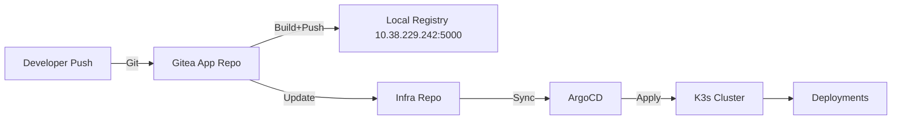
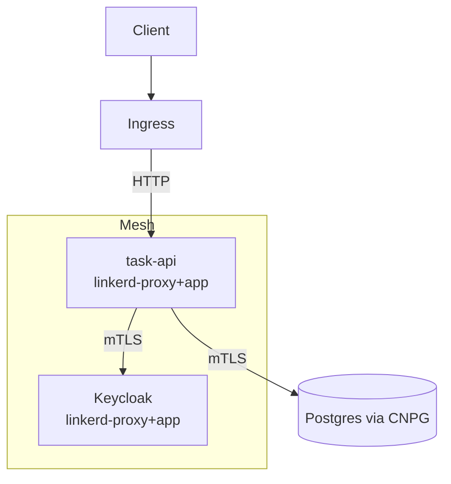

# Cloud Native Gauntlet Documentation

## Service Mesh: Linkerd

### Overview
Linkerd is a lightweight, ultra-reliable service mesh for Kubernetes. It provides mTLS encryption, observability, and traffic management between your microservices.

### Installation Steps
1. **Install Gateway API CRDs:**
   ```sh
   kubectl apply -f https://github.com/kubernetes-sigs/gateway-api/releases/download/v1.2.1/standard-install.yaml
   ```
2. **Install Linkerd CRDs:**
   ```sh
   linkerd install --crds | kubectl apply -f -
   ```
3. **Install Linkerd Control Plane:**
   ```sh
   linkerd install | kubectl apply -f -
   kubectl wait --for=condition=available --timeout=300s deployment/linkerd-controller -n linkerd
   ```
4. **Install Linkerd Viz Extension:**
   ```sh
   linkerd viz install | kubectl apply -f -
   kubectl wait --for=condition=available --timeout=300s deployment/linkerd-viz -n linkerd-viz
   ```

### Deployment Annotation for Sidecar Injection
Add the following annotation to both the deployment and pod template metadata:
```yaml
metadata:
  annotations:
    linkerd.io/inject: enabled
```

### Validation
- **Check for Sidecar Injection:**
  ```sh
  kubectl get pods -n backend <task-api-pod> -o yaml | grep linkerd-proxy
  kubectl get pods -n keycloak <keycloak-pod> -o yaml | grep linkerd-proxy
  ```
- **Use Linkerd Viz Dashboard:**
  ```sh
  kubectl -n linkerd-viz port-forward svc/web 8084:8084
  # Visit http://linkerd.local
  ```
- **Observe Traffic and mTLS:**
  ```sh
  linkerd viz tap deploy/task-api -n backend
  linkerd viz tap deploy/keycloak -n keycloak
  linkerd viz edges po -n backend
  ```

### Service Mesh Validation

- **Sidecar Injection:**
  - Verified with:
    ```sh
    kubectl get pods -n backend <task-api-pod> -o yaml | grep linkerd-proxy
    kubectl get pods -n keycloak <keycloak-pod> -o yaml | grep linkerd-proxy
    ```
  - 

- **Linkerd Viz Dashboard:**
  - Accessed at: [http://linkerd.local](http://linkerd.local)
  - 

- **Namespace and Deployment Details:**
  - Backend namespace: [http://linkerd.local/namespaces/backend](http://linkerd.local/namespaces/backend)
  - Keycloak namespace: [http://linkerd.local/namespaces/keycloak](http://linkerd.local/namespaces/keycloak)
  - Task API deployment: [http://linkerd.local/namespaces/backend/deployments/task-api](http://linkerd.local/namespaces/backend/deployments/task-api)
  - Keycloak deployment: [http://linkerd.local/namespaces/keycloak/deployments/keycloak](http://linkerd.local/namespaces/keycloak/deployments/keycloak)
  - 
  - 

- **Live Traffic Tap:**
  - Tap URL: [http://linkerd.local/namespaces/backend/deployments/task-api/tap](http://linkerd.local/namespaces/backend/deployments/task-api/tap)
  - CLI command used:
    ```sh
    linkerd viz tap deploy/task-api -n backend
    ```
  - 

- **mTLS and Edges:**
  - Verified mTLS and service edges in dashboard and CLI.
  - 

### Troubleshooting
- If sidecar is not injected, check annotation placement and re-apply deployments.
- If Viz commands fail, ensure the extension is installed and pods are running.

---

## Monitoring: Prometheus & Grafana

### Overview
Prometheus collects metrics from your services, and Grafana visualizes them with dashboards.

### Deployment Steps
1. **Deploy Prometheus and Grafana manifests:**
   - `monitoring/prometheus.yaml`
   - `monitoring/grafana.yaml`
2. **Expose Grafana via ingress:**
   - Access at `http://grafana.local/`

### Validation
- **Access Grafana dashboard:**
  - Confirm metrics for app, DB, Keycloak, and mesh.
- **Check Prometheus targets:**
  - Ensure all services are being scraped.

### Troubleshooting
- If dashboards are empty, check Prometheus scrape configs and service annotations.
- If Grafana is inaccessible, check ingress and `/etc/hosts`.

---

## General Project Docs

### Architecture Diagram (Mermaid)
```
mermaid
flowchart TD
    subgraph K3s Cluster
        A[Task API] -->|JWT| B(Keycloak)
        A -->|DB| C(Postgres)
        B -->|Auth| C
    end
    D[User] --> A
    D --> B
```

### How-to Guide
- Step-by-step instructions for reproducing the setup from scratch.
- Include all commands and file paths.

### Idempotence Note
- All scripts and manifests are idempotent. Rerunning them will not break the cluster.

### Comic Relief
- "In YAML, no one can hear you scream."
- "If your pod is CrashLoopBackOff, just blame the indentation."

---

*Update this file as you complete monitoring and other components!*

## CI → Infra → ArgoCD (GitOps Pipeline)



## Linkerd Mesh (mTLS)


