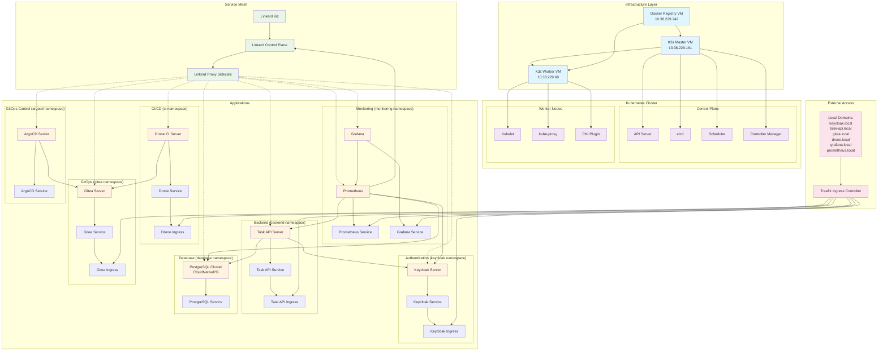

# Cloud Native Gauntlet - Architecture Diagram

## System Architecture Overview

## Component Details

### Infrastructure
- **Multipass VMs**: Lightweight Ubuntu VMs running K3s
- **Docker Registry**: Local container registry for offline deployment
- **K3s**: Lightweight Kubernetes distribution

### Service Mesh
- **Linkerd**: Ultra-lightweight service mesh providing mTLS and observability
- **Linkerd Viz**: Observability dashboard for service mesh

### Applications
- **Keycloak**: Identity and access management with JWT authentication
- **Task API**: Rust-based REST API with PostgreSQL backend
- **PostgreSQL**: CloudNativePG-managed database cluster
- **Drone CI**: Continuous integration server
- **Gitea**: Self-hosted Git service
- **Prometheus**: Metrics collection and alerting
- **Grafana**: Metrics visualization and dashboards
- **ArgoCD**: GitOps continuous deployment

### External Access
- **Traefik**: Ingress controller for external access
- **Local Domains**: Development-friendly domain names