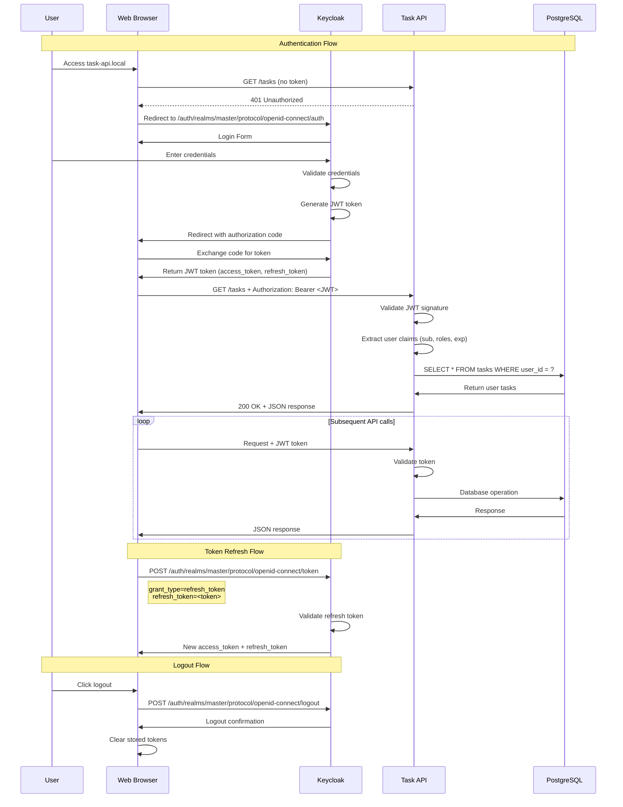
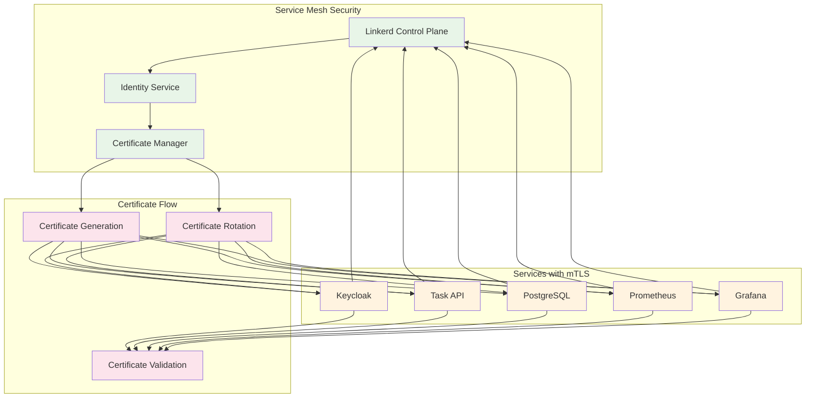

# Cloud Native Gauntlet - Authentication Flow Diagram

## JWT Authentication Flow with Keycloak



## Role-Based Access Control (RBAC)

```mermaid
graph TB
    subgraph "Keycloak Realm"
        REALM[Master Realm]
        USERS[Users]
        ROLES[Roles]
        CLIENTS[Clients]
    end
    
    subgraph "User Roles"
        ADMIN[Admin Role]
        USER[User Role]
    end
    
    subgraph "API Endpoints"
        ADMIN_ENDPOINTS[Admin Endpoints:<br/>- GET /admin/users<br/>- POST /admin/tasks<br/>- DELETE /admin/tasks]
        USER_ENDPOINTS[User Endpoints:<br/>- GET /tasks<br/>- POST /tasks<br/>- PUT /tasks/:id<br/>- DELETE /tasks/:id]
    end
    
    subgraph "JWT Token Claims"
        SUB[sub: user-id]
        ROLES_CLAIM[roles: ['admin', 'user']]
        EXP[exp: expiration]
        ISS[iss: keycloak issuer]
    end
    
    %% Role assignments
    USERS --> ADMIN
    USERS --> USER
    
    %% Role to endpoint mapping
    ADMIN --> ADMIN_ENDPOINTS
    ADMIN --> USER_ENDPOINTS
    USER --> USER_ENDPOINTS
    
    %% Token generation
    REALM --> ROLES_CLAIM
    ADMIN --> ROLES_CLAIM
    USER --> ROLES_CLAIM
    
    %% Styling
    classDef keycloak fill:#e3f2fd
    classDef roles fill:#f1f8e9
    classDef endpoints fill:#fff3e0
    classDef token fill:#fce4ec
    
    class REALM,USERS,ROLES,CLIENTS keycloak
    class ADMIN,USER roles
    class ADMIN_ENDPOINTS,USER_ENDPOINTS endpoints
    class SUB,ROLES_CLAIM,EXP,ISS token
```

## Service Mesh Security (mTLS)



## Security Features

### JWT Authentication
- **Keycloak Integration**: Centralized identity management
- **OpenID Connect**: Industry-standard authentication protocol
- **Token Validation**: Signature verification and expiration checking
- **Role-Based Access**: Fine-grained permission control

### Service Mesh Security
- **mTLS Encryption**: Automatic encryption between services
- **Certificate Management**: Automatic certificate generation and rotation
- **Identity Verification**: Service-to-service authentication
- **Traffic Encryption**: All inter-service communication encrypted

### API Security
- **Bearer Token**: JWT tokens in Authorization header
- **Role Validation**: Endpoint access based on user roles
- **Token Refresh**: Automatic token renewal
- **Secure Logout**: Proper token invalidation

### Network Security
- **Ingress Controller**: Traefik provides TLS termination
- **Local Domains**: No external DNS exposure
- **Firewall Rules**: VM-level network isolation
- **Private Registry**: Container images stored locally