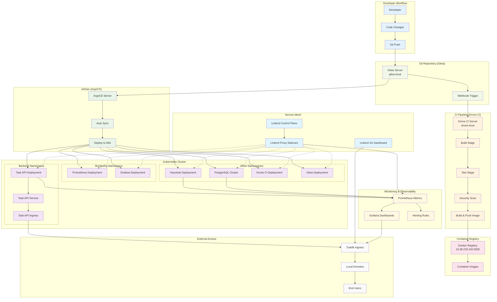

# Cloud Native Gauntlet - CI/CD Pipeline Diagram

## Complete CI/CD Pipeline Flow

## Pipeline Stages Detail

### 1. Developer Workflow
- Developer makes code changes
- Commits and pushes to Gitea repository
- Triggers webhook to Drone CI

### 2. CI Pipeline (Drone CI)
- **Build Stage**: Compile Rust application, run tests
- **Test Stage**: Unit tests, integration tests
- **Security Stage**: Vulnerability scanning
- **Image Stage**: Build Docker image and push to registry

### 3. GitOps Flow (ArgoCD)
- ArgoCD monitors Git repository changes
- Automatically syncs new configurations
- Deploys updated applications to Kubernetes

### 4. Service Mesh Integration
- Linkerd automatically injects sidecar proxies
- Provides mTLS encryption between services
- Enables observability and traffic management

### 5. Monitoring & Observability
- Prometheus collects metrics from all services
- Grafana provides visualization dashboards
- Linkerd Viz shows service mesh topology

### 6. External Access
- Traefik ingress controller routes external traffic
- Local domain names provide easy access
- End users can access applications via web browsers

## Key Features

### Automated Deployment
- **GitOps**: Configuration as code, automatic deployment
- **Service Mesh**: Automatic sidecar injection and mTLS
- **Monitoring**: Automatic metrics collection and alerting

### Offline Capability
- **Local Registry**: All images stored locally
- **Self-hosted Git**: Gitea provides Git hosting
- **Local Domains**: No external DNS dependencies

### Security
- **mTLS**: Automatic encryption between services
- **RBAC**: Role-based access control
- **JWT Authentication**: Secure API access

### Observability
- **Metrics**: Comprehensive application and infrastructure metrics
- **Dashboards**: Real-time visualization
- **Service Mesh**: Traffic flow and performance monitoring